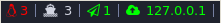

# i3Blocks



Some handy scripts I wrote to customize [i3blocks](https://vivien.github.io/i3blocks/)

# Requirements

* [i3](https://i3wm.org/)
* [i3blocks](https://vivien.github.io/i3blocks/)

# Installation

```shell
git clone https://github.com/alrayyes/i3blocks.git
```

# Arch Updates

## Description
Lists number of [Arch Linux](https://www.archlinux.org/) package updates available

## Source
```shell
#!/bin/sh
# Arch upgradeable packages

list=`pacman -Sup 2> /dev/null`

if [ "$list" == ":: Starting full system upgrade..." ]; then
    count=""
else
    count=`echo "$list" | wc -l`
fi

echo "$count"
```

## i3blocks config
```shell
[arch-updates]
command=~/i3blocks/archupdates
label=
color=#FF0000
interval=3600
```

# Docker Containers

## Description
Lists number of [Docker](https://www.docker.com/) containers running

## Source
```shell
#!/bin/sh

docker ps -q | wc -l | sed -r 's/^0$//g'
```

## i3blocks config
```shell
[docker-containers]
label= 
command=~/i3blocks/container
interval=5
```
# Gmail

## Description
Lists number of unread emails in [Gmail](https://www.google.com/gmail) inbox
## Source
```shell
#!/bin/bash

# Requires https://www.google.com/settings/security/lesssecureapps for gmail.

CONFIG_FILE="${BLOCK_INSTANCE}"
CONFIG_FILE=${CONFIG_FILE/\~/$HOME}

# Config file needs the following settings:
#MAIL_USER="user@domain.tld"
#MAIL_PASSWORD="secret"

if [[ ! -f "${CONFIG_FILE}" ]]; then
  echo "${CONFIG_FILE}"
  exit 33
fi
```

## i3blocks config
```shell
[gmail]
command=~/i3blocks/gmail
label=G
instance=~/.mysupersecretgmaillogin
interval=60
color=#00FF00
```
## ~/.mysupersecretgmaillogin
```shell
MAIL_USER="john.doe@gmail.com"
MAIL_PASSWORD="password123"
```

# What is My Ip

## Description
Prints your external ip address

## Source
```shell
#!/bin/sh

ip=$(curl -s icanhazip.com);

if [[ "$BLOCK_BUTTON" -eq 1 ]];
then
	netname=$(whois $ip | grep '^netname:' | awk '{print $2}' | tail -1);
	echo "$netname"
else
	echo "$ip"
fi
```

## i3blocks config
```shell
[whatismyip]
label= 
command=~/i3blocks/whatismyip
color=#00FF00
interval=30
```

# License

This theme is released under the MIT License. For more information read the [license][license].

[license]: https://github.com/alrayyes/i3blocks/blob/master/LICENSE.md
